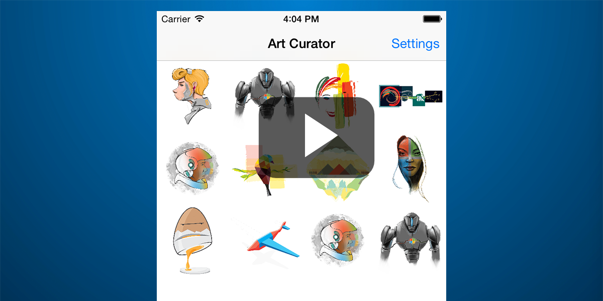

# O365 iOS Art Curator
[](https://travis-ci.org/OfficeDev/O365-iOS-ArtCurator)

In diesem Beispiel wird veranschaulicht, wie Sie die Outlook-E-Mail-API verwenden, um E-Mails und Anhänge aus Office 365 abzurufen. Die API ist für iOS, [Android](https://github.com/OfficeDev/O365-Android-ArtCurator), [Web (Angular Web App)](https://github.com/OfficeDev/O365-Angular-ArtCurator) und [Windows Phone](https://github.com/OfficeDev/O365-WinPhone-ArtCurator) ausgelegt. Informationen hierzu finden Sie auch in unserem [Artikel in Medium](https://medium.com/@iambmelt/14296d0a25be) .
<br />
<br />
<br />
Das Beispiel zum Art Curator veranschaulicht, wie Sie Ihren Posteingang auf andere Weise anzeigen. Angenommen, Sie besitzen ein Unternehmen, das künstlerisch gestaltete T-Shirts verkauft. Als Inhaber des Unternehmens erhalten Sie eine Vielzahl von E-Mails von Künstlern mit Designs, die Sie von den Künstlern erwerben sollen. Derzeit verwenden Sie Ihren E-Mail-Client, um jede Nachricht und jeden Anhang einzeln zu öffnen. In diesem Beispiel wird gezeigt, wie Sie stattdessen Art Curator verwenden können, um alle Anhänge Ihres Posteingangs (nur JPG- und PNG-Dateien) direkt anzuzeigen und so auf effiziente Weise die gewünschten Designs auszuwählen. 

[](https://youtu.be/4LOvkweDfhY "Klicken Sie, um das Beispiel in Aktion zu sehen.")

In diesem Beispiel werden folgende Vorgänge der Outlook Services-E-Mail-API veranschaulicht: 

* [Abrufen von Ordnern](https://msdn.microsoft.com/office/office365/APi/mail-rest-operations#GetFolders)
* [Abrufen von Nachrichten](https://msdn.microsoft.com/office/office365/APi/mail-rest-operations#Getmessages) (einschließlich Filtern und Verwendung der Auswahl) 
* [Abrufen von Anhängen](https://msdn.microsoft.com/office/office365/APi/mail-rest-operations#GetAttachments)
* [Aktualisieren von Nachrichten](https://msdn.microsoft.com/office/office365/APi/mail-rest-operations#Updatemessages)
* [Erstellen und Senden von Nachrichten](https://msdn.microsoft.com/office/office365/APi/mail-rest-operations#Sendmessages) (mit und ohne Anhang) 


Voraussetzungen
==
* [Xcode](https://developer.apple.com/xcode/downloads/) von Apple
* Installation von [CocoaPods](https://guides.cocoapods.org/using/using-cocoapods.html) als Abhängigkeits-Manager.
* Ein Office 365-Konto. Sie können sich für ein [Office 365 Developer-Abonnement](https://msdn.microsoft.com/en-us/library/office/fp179924.aspx) registrieren, mit dem Sie die Ressourcen erhalten, die Sie zum Erstellen von Office 365-Apps benötigen.


**Hinweis**<br/>
Sie müssen zudem sicherstellen, dass Ihr Azure-Abonnement an Ihren Office 365-Mandanten gebunden ist. Eine Anleitung finden Sie im Blogbeitrag des Active Directory-Teams [Creating and Managing Multiple Windows Azure Active Directories](http://blogs.technet.com/b/ad/archive/2013/11/08/creating-and-managing-multiple-windows-azure-active-directories.aspx) (Erstellen und Verwalten mehrerer Windows Azure Active Directories). 

In diesem Beitrag finden Sie unter „Adding a new directory“ (Hinzufügen eines neuen Verzeichnisses) Informationen über die entsprechende Vorgehensweise. Weitere Informationen finden Sie auch unter [Set up Azure Active Directory access for your Developer Site](https://msdn.microsoft.com/office/office365/howto/setup-development-environment#bk_CreateAzureSubscription) (Einrichten des Zugriffs auf Active Directory für Ihre Entwicklerwebsite).

Einrichten eines Xcode-Projekts
==
* Klonen Sie dieses Repository.
* Verwenden Sie CocoaPods zum Importieren von ADAL iOS, O365 iOS SDK und SDWebImage.
        
	     pod 'ADALiOS', '~> 1.2.1'
	     pod 'Office365/Outlook', '= 0.9.1'
	     pod 'Office365/Discovery', '= 0.9.1'
	     pod 'SDWebImage', '~>3.7'

 Diese Beispiel-App enthält bereits eine POD-Datei, die die Office 365 und ADAL-Komponenten (pods) in das Projekt überträgt. Navigieren Sie einfach über das **Terminal** zum Projekt, und führen Sie Folgendes aus: 
        
        pod install
        
   Weitere Informationen finden Sie unter **Verwendung von CocoaPods** in [Zusätzliche Ressourcen](#AdditionalResources).
    
Zum ersten Mal starten
==

Diese App enthält vorregistrierte Anwendungsinformationen in Azure mit den Berechtigungen **E-Mail als Benutzer senden** und **Benutzer-E-Mails lesen und schreiben**.

Die App-Informationen sind im ```Office365Client.m``` definiert.

    
        // App information
        static NSString * const REDIRECT_URL_STRING = @"https://UseOnlyToRunTheArtCuratorSample";
        static NSString * const CLIENT_ID           = @"1feaa784-0130-48d9-adeb-776fc65888c5";
        static NSString * const AUTHORITY           = @"https://login.microsoftonline.com/common";
        
Registrieren Sie für Ihre eigene App [Ihre systemeigene Clientanwendung in Azure](https://msdn.microsoft.com/library/azure/dn132599.aspx#BKMK_Adding).

Geben Sie den Umleitungs-URI an, wenn Sie die Anwendung registrieren. Rufen Sie als Nächstes die Client-ID von der Seite **CONFIGURE** ab. 
Die Anwendung *muss* über die Berechtigungen **E-Mails als Benutzer senden** und **Benutzer-E-Mails lesen und schreiben** verfügen.

Weitere Informationen finden Sie unter [iOS-O365 Connect-Beispiel]()

Einschränkungen
==
* Unterstützung anderer Dateien als ```.png``` und ```.jpg```
* Verarbeitung von E-Mails mit mehreren Anhängen
* Paging (Abrufen von mehr als 50 E-Mails)
* Verarbeitung der Eindeutigkeit von Ordnernamen

Fragen und Kommentare
==
* Wenn Sie beim Ausführen dieses Beispiels Probleme haben, [melden Sie sie bitte](https://github.com/OfficeDev/O365-iOS-ArtCurator/issues").
* Allgemeine Fragen zu den Office 365-APIs können Sie auf [Stack Overflow](http://stackoverflow.com/) stellen. Stellen Sie sicher, dass Ihre Fragen oder Kommentare mit [Office365] und [outlook-restapi] markiert sind.

Problembehandlung
==
Mit dem Xcode 7.0-Update ist App Transport Security für Simulatoren und Geräte mit iOS 9 aktiviert. Informationen hierzu finden Sie unter [App Transport Security Technote](https://developer.apple.com/library/prerelease/ios/technotes/App-Transport-Security-Technote/).

Für dieses Beispiel wurde eine vorübergehende Ausnahme für die folgende Domäne in der PLIST erstellt:

- outlook.office365.com

Wenn diese Ausnahmen nicht enthalten sind, treten bei allen Aufrufen der Office 365-API in dieser App Fehler auf, wenn sie für einen iOS 9-Simulator in Xcode bereitgestellt wird.

Weitere Ressourcen
==
* [Get started with Office 365 APIs in apps](http://aka.ms/get-started-with-js) (Erste Schritte mit Office 365-APIs in Apps)
* [Office 365 APIs platform overview](http://msdn.microsoft.com/office/office365/howto/platform-development-overview) (Office 365-APIs – Plattformübersicht)
* [Office Dev Center](http://dev.office.com/)
* [Using CocoaPods](https://guides.cocoapods.org/using/using-cocoapods.html) (Verwendung von CocoaPods)
* [Art Curator für Android](https://github.com/OfficeDev/O365-Android-ArtCurator)
* [Art Curator für Windows Phone](https://github.com/OfficeDev/O365-WinPhone-ArtCurator)
* [Art Curator für Web (Angular Web App)](https://github.com/OfficeDev/O365-Angular-ArtCurator)

Copyright
==
Copyright (c) 2015 Microsoft. Alle Rechte vorbehalten.
